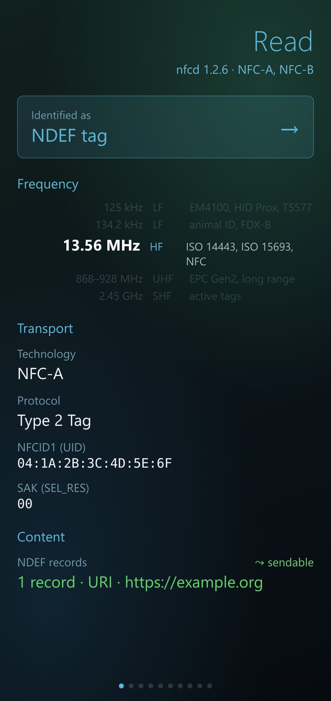
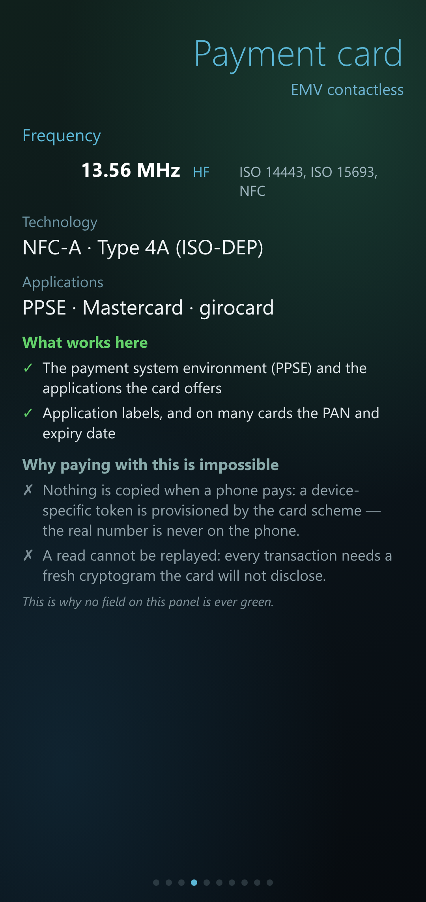
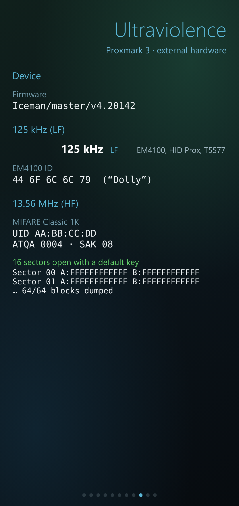
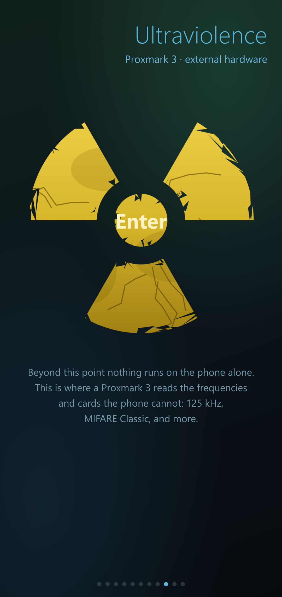

# iNFC

A native NFC app for **SailfishOS** that reads, identifies, stores and
emulates NFC tags and smart cards — and, in its `uv` variant, drives an
external **Proxmark 3** for the frequencies and cards the phone cannot reach
on its own.

It talks to `nfcd` over D-Bus and **never polls in the background**: the radio
stays quiet until you explicitly pull down and choose *Read*.

> Built and tested on a Sony Xperia 10 III (SailfishOS 5.x, aarch64).

|  |  |  |  |
|---|---|---|---|
|  |  |  |  |

*(Screenshots use example/pseudo data — no real cards.)*

## The colour contract

One rule runs through the whole UI:

* **white** — data that was read off the card
* **green** — data this phone can actually send back out again (via host card
  emulation)

Green therefore means exactly one thing: it survives the round trip through
emulation. Everything the hardware cannot re-emit stays white, no matter how
interesting it is. On a payment-card page, for instance, nothing is ever green.

## Two variants, one source tree

| Variant | Package | What it is |
|---|---|---|
| **iNFC** | `harbour-infc` | The base app. NFC only. No external hardware, no sound. Publishable. |
| **iNFC uv** | `harbour-infc-uv` | Everything in the base app **plus** Proxmark 3 support (the "Ultraviolence" page) and a sound cue. |

They install side by side as two separate apps with separate archives. Only
the base app is offered as a downloadable release binary; the `uv` variant is
source-only — build it yourself.

### Base app features

* On-demand reading — the radio is off until you ask; nothing is scanned in
  the background.
* A swipeable carousel of panels, one per card family, each with a plain
  *what works here / what does not, and why* explanation.
* Identifies payment cards, German eID / ePassport, the electronic health card
  (eGK), NDEF tags, MIFARE Ultralight / NTAG, security tokens and more.
* Decodes NDEF records (URI, text, vCard, Wi-Fi), reads and writes Type 2 tags,
  and emulates a Type 4A NDEF tag (host card emulation).
* Decodes `EF.CardAccess` (PACE security infos) and the ATS interface bytes,
  with a built-in reference glossary for every raw value on screen.
* A worked-example decoder for Philips Sonicare (BrushSync) brush heads.
* A named, dated archive with separate comments, plus JSON export/import.
* English UI with a full German translation.

### uv-only additions (Proxmark 3 over USB)

* **125 kHz LF badge search** — EM4100, HID Prox, IO Prox.
* **T5577 writing** — clone an EM4100 id onto a blank T5577 (and a "Dolly"
  test writer).
* **13.56 MHz reader** — UID / ATQA / SAK, which finally tells you whether a
  card is MIFARE Classic (which the phone's own stack refuses).
* **MIFARE Classic** — default-key dictionary check across all sectors, then a
  full 64-block dump using the found keys.

## Building

Uses the SailfishOS Platform SDK (`mb2`). The two variants are selected by
their spec files — note that `--specfile` goes **before** `build`:

```sh
# base app  -> harbour-infc
mb2 -t <target> --specfile rpm/harbour-infc.spec build

# uv variant -> harbour-infc-uv   (passes CONFIG+=uv to qmake)
mb2 -t <target> --specfile rpm/harbour-infc-uv.spec build
```

The split is a single `CONFIG+=uv` switch in `harbour-infc.pro`: it changes the
target, adds the Proxmark/sound sources, links libpulse, and installs the
uv-only QML and assets. The base build carries none of it.

## A note on the uv variant

The Proxmark features are dual-use security-research tooling for your **own**
hardware and cards (badge cloning, MIFARE Classic dumping). Use them only where
you are authorised to. The base `iNFC` app has none of this.

## License

GPLv3. See [LICENSE](LICENSE) and [THIRD-PARTY-NOTICES.md](THIRD-PARTY-NOTICES.md).
